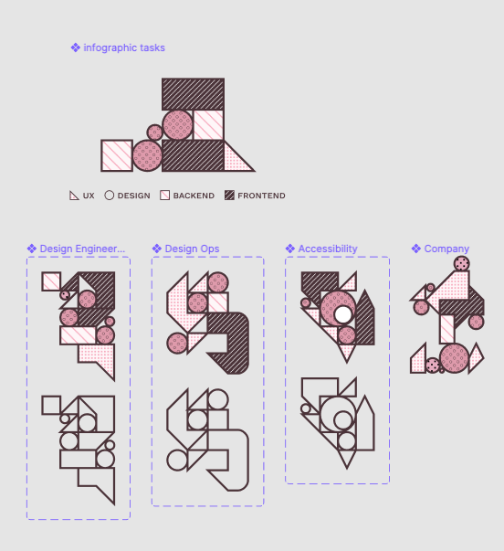




On this website you can see these simple shape compositions everywhere. I do like using very simple graphical elements to create some form of... let's just say _illustration_. I rarely make things like these without encoding some form of meaning into its units.

In Figma, I created these little "diagrams" where these shape compositions are filled with some patterns. They would serve the purpose of visually communicating what types of tasks I was doing at a given employment on my work-experience timeline:

## Early Attempts

I had some idea of implementation in my head when I was putting them together in Figma, but I didn't think it all the way through. I knew I just needed to somehow set background-images for individual elements. I soon came to realize that this was in fact not as easy as I thought it would be.

Firstly, Figma couldn't export them properly as svg. Or I did something wrong - in any case, exporting them did only work if I would export them in a non-svg format, like PNG. So for the time being, I kept them in PNG. But obviously that didn't look nice. Plus, the diagrams themselves featured a little caption. I knew that I didn't want to make a picture of text that would just as well live as _real_ text, so I started looking for alternative ways.

{{ pullLink({ href: 'https://css-tricks.com/almanac/properties/f/fill/#values', external: true, text: 'the CSS property fill', caption: 'css-tricks.com' }) }}

I first followed the idea of setting the background with just CSS. There are some great pattern creators that use the versatility of gradients as background-images. But it's not possible to define a `background-image` in the `fill` property. It can only accept color-values _but_ it can also accept links to `<pattern>`, with `url(#id-of-the-pattern-element)`, as I found out from css-tricks.com.

## Hello yes, this is pattern

I have tinkered with really small things in SVG, but it mostly involved masks or background-images set with CSS. So the `<pattern>` element was entirely new to me! In my opinion, it works rather intuitively.

{{ pullLink({ href: 'https://developer.mozilla.org/en-US/docs/Web/SVG/Tutorial/Patterns', external: true, text: 'MDN SVG Patterns Tutorial', caption: 'developers.mozilla.com' }) }}

`<pattern>` elements should go into `<defs>`, according to MDN. It does make sense, they are defined to be referred to. The element itself needs dimensions, set with `width` and `height` and an `id` so that it can be referenced with `url(#)` in `fill`. Now you can also intervene how the defined elements relate to its available geometry, with `patternUnits` and `patternContentUnits` (in other words, this will affect how the pattern fills its element, when being used). In my example, setting `patternUnits="userSpaceOnUse"` had exactly the effect that I wanted.

{{ pullLink({ href: 'https://riptutorial.com/svg/example/19858/pattern-coverage-with-combinations-of-patternunits-and-patterncontentunits#example', external: true, text: 'Example on patternUnits and patternContentUnits'}) }}

### Using an image file as SVG pattern

This is what I did first; I exported all of my patterns from Figma (which is a little story for itself) and set an `<image href="" />` within my `<pattern>`. Here's an example of how that works:

{{ codepen({ id: 'MWpRerQ' }) }}

This worked great! But, on helloyes.dev, users can change the accent color. And the patterns have the pink _hardcoded_ into them. Now I could have exported the patterns with different accent colors from figma and then change the `href`'s in the `<pattern>`'s, but that would have been quite a lot of work and it felt... _wrong_.

Another solution might have been to overlay the images with maybe a pseudo-element with the accent-color as background and then maybe work with a filter - but that felt even _more wrong_. So I decided to just try to recreate the patterns with regular SVG.

### Using SVG shapes as SVG Pattern

This works exactly like you probably expect it to work: Instead of putting using `<image>` you just put any other SVG in there! Check out this example:

{{ codepen({ id: 'ExWJyqz' }) }}

The pattern itself is a rectangle that is being tiled along wherever it is being used. By setting its dimensions you define a coordinate system on which you can relatively place your shapes. Now I can also use the custom property that contains the potential override as the fill with inline style. You can see more examples on this website. You can either just look into the sourcecode or look at it [on github](https://github.com/nachtfunke/helloyes/commit/bd79e2df4d56db5b3a6cf706196807b2751dc8f9#diff-7b965053508f6747b67aa042aa360f45e6f873fa0252e0f5f88aa2074bf68cac). If you change the color of this website, the patterns as used on the work page for example will change accordingly.

Here's one weird thing that _might_ happen to you to - I am used to writing self-closing elements without a slash, as I'm used to in HTML5. But in SVG, `<rect />` is the correct syntax, because XML (I am assuming!). I even posted a stack overflow lol, because I just couldn't think of what was going on here. But I eventually found out.

## What about more complex patterns?

For the more complex patterns that, even if they don't look that complex would be rather difficult to hand-code (at least for me), I used figma. Especially when there are diagonal lines that go from corner to corner, a visual interface will be very handy. For this case I prepared my pattern in an artboard and then copied the SVG from Figma and then proceeded to take out everything that I didn't need.

***

Honestly, I was rather surprised how intuitive and easy this was. I _love_ the result. I think its amazing that this is possible. I hope someone finds this helpful somehow. Also, all of this started with these patterns that I [found on github](https://github.com/skumando/figma-patterns) (for figma). I made them available as a public figma library and [you can play with it](https://www.figma.com/community/file/978689698060140147). Maybe I'll also make them available as SVG patterns on github, because maybe that'd help someone even more?