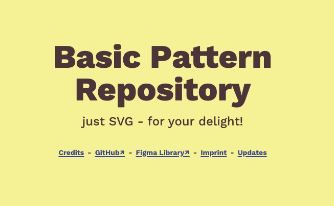




This time of the year usually means introspection, readjustment and realignment for me on a personal level. This time, it's really special, as I reflect upon the last 6 months, since leaving my previous job. I _decided_ to leave.

I left a lot behind, because the individuals that made up my team and the greater company in general, where and still are exceptional to me in so many ways. Leaving easyname was very difficult for me and I didn't yet know how difficult it would be, in the months coming.

While I also reflect on this - privately - I wanna take this time to _publicly_ take an inventory of the constructive things that I was able to do in this time. In narrative therapy, we call this "internalising", in which we bring a narrative _closer_ to us. This usually takes out the volatility of a narrative and instead solidifies it.

Usually I write myself a letter, by hand. This time, I wanna see if maybe there is value in making some of that process public and share it with other people.

## I made a tiny personal brand

I created the "hello, yes." brand! It is something that I used to say in our internal team chats whenever I started a new conversation. It has a certain quality of _derp_ that just speaks to me. And where I took it visually, it quickly started to feel like an iteration on what little there was before, when my personal website was just "thomassemmler.com":

<figure>
    
    <figcaption>The old thomassemmler.com. I never invested too much time into it, and it ran on jekyll. So I decided to redo it entirely.</figcaption>
</figure>

I recycled "Work Sans" as the main headline font, and I added "Poppins" as the paragraph font. As I started working on it, I realized that maybe a new domain would not be too bad of an idea. I had the domain "fantastic.horse" for a year, just because I found the domain "pudding.cool" so dumb that to this day it makes me giggle that someone came up with this idea. That is how the idea to re-brand myself not just with my name but with "hello, yes." came about in the first place, and it inspired me, so I went for it.

<figure>
    
    <figcaption>The first draft of the desktop version of the website.</figcaption>
</figure>

I have this weird desire to use graphical elements to fill up space. Just because I don't wanna throw some meaningless words at the canvas but I also don't wanna show photos, so graphical elements it is. Yet I am not an illustrator, so I often end up making simple compositions with basic shapes or textures. This is how these shape-composition illustrations started as well.

<figure>
    
    <figcaption>The illustrations are composed of really simple shapes.</figcaption>
</figure>

I had fun finding a rule set for these compositions. Analog generative art maybe? I am actually planning to do some generative experimentation with them. They actually also lead me to experiment with inline SVG patterns! I even blogged about this:

{{ pullLink({
    href: '/blog/2021/very-simple-patterns-with-svg',
    text: 'Very simple Patterns with SVG',
    caption: 'from my blog'
}) }}

I originally started out with a different layout, inspired by [Andy Clarke's article on compound grids](https://stuffandnonsense.co.uk/blog/using-a-4-5-compound-grid). But I eventually had to write 4x the media queries, because of how the main-column on the website was defined. So in the next iteration, I rid myself from that pain and returned to a plain old single column. It's still a compound grid, but it's centered now. For the most part. A perfect use case for container queries, btw. If you haven't noticed, [they are coming](https://www.miriamsuzanne.com/speaking/responsive-components/).

## I connected with exceptional people

On the development side of things, I decided to reach for eleventy. I always knew that I wanted the site to be statically generated. I've worked with jekyll before, so moving to eleventy seemed logical and that journey was mostly very smooth, but I did run into some things that I needed help with. That's when I discovered that there was actually an eleventy community discord, with quite a few very active people in it!

And while I asked questions and received useful answers (usually very quickly), I also started helping other people with their small problems, as I had already encountered and fixed some of them myself before.

I also noticed that they even had an official Meetup! I attended the very first one meetup and was just amazed by how close some of these people all of a sudden felt to me. This was a big deal, because even at my previous work, only my colleague and now friend [Cezar Neaga](https://twitter.com/cezarneaga/) was actively participating in community activity surrounding frontend web dev. But to have so many people close to the domain that I am also continuously falling in love with? That was quite a formative experience for me. It allowed me to see that I can actually connect with people, not just by reading articles and sending an occasional tweet, but more meaningfully.

### THE Elventy Meetup

They announced that one of their co organizers had to step down and that they were looking for a new member. I did not hesitate _a single second_ and asked to join immediately. This was important to me, because I saw a chance to contribute to a community that I quickly started to identify with. I didn't wanna mess this up, so I tried to keep my steamrolling as low as possible. The coolest part is that I get to collaborate with [Sia Karamalegos](https://sia.codes/) & [Stephanie Eckles](https://thinkdobecreate.com/) on a thing that is intended to create community. I just love that. And we even [won an award](https://jamstackconf.com/jammies/) for "Outstanding Community Meetup" during the Jamstack Conf 2021!

{{ pullLink({
    external: true,
    href: 'https://11tymeetup.dev/',
    text: 'THE Eleventy Meetup',
    caption: '11tymeetup.dev'
}) }}

### Frontend Horse

During that same time, I also stumbled upon Frontend Horse stream on twitch, by accident. And they just happened to also have a discord community, which I quickly joined and discovered lots and _lots_ of really fantastic people there! It was then that I realized how much I had craved to feel connected to community and that even during my previous employments over the years I never felt this.

{{ pullLink({
    external: true,
    href: 'https://frontend.horse/shows',
    text: 'Frontend Horse Twitch Schedule',
    caption: 'frontend.horse'
}) }}

These two  communities specifically made a big impact on me and changed how I now relate to myself as a developer/designer and how I related to the industry at large through the lense of my craft. This was really important to me. Leaving easyname was necessary but difficult, emotionally and socially. These communities filled a very real need for connection and social interaction which helped me get through his transitional period in my life and career.

It allowed me to connect with many amazing people, beyond just the discord channels and streams: Stephanie Eckles, Ben Myers, Ben Holmes, Alex Trost, David Aerne, Manni Ikomi, Anatole Ayadi and so many more. Some of these people offered their ear to me and offered their professional expertise and their personal advice when I really needed it. Having these connections made a big difference, professionally and personally. The sad part is that I will probably never meet many of these people in person - but I have learned to not assume too much about these things, one never knows!

## I blogged

Also, after 10 years of wanting to do so, [I started blogging](/blog). I've written 6 posts - plus one post that remains private. I didn't find it too difficult to come up with topics to write about, though I do find it sometimes a bit challenging to not just _rant_ about stuff. Also my habit of just word-vomiting out stuff gets just a bit more held in check by people actually _reading_ it and then telling me about my spelling mistakes.

I'm still refining my approach how I write. I am maintaining a somewhat _decentralized_ backlog of topics I want to talk about. As in, some of it lives in my phone, some lives in an obscure trello board (I think) and there is actually an A5 yellow postIt flying around my flat somewhere, that I cannot find. Oh well. One could call it an _organic_, maybe even a self-organizing process.

## I tweeted

I am in my personal life not invest in social media. I have accounts everywhere except tiktok, but I only really use twitter, where I have developed a habit of _ranting_ about the industry. I took notice those few followers that I have tend to not really care bout this at all, as they are usually not reacting. But it still feels cathartic to me. There is a lot of stupidity happening on tech twitter that I don't really like. I do not want to be seen as part of the grifter section on twitter, so I'd rather be seen as critical, a devil's advocate even.

Also, I am really happy with the velocity of growth of my following, because it keeps my bubble quite far away from much of the nonsense that I notice people with larger followings seem to be subjected to. I would still like to grow my following though - but this speed seems to be pleasant to me. I grew from ~100 followers to ~250. Maybe I can aim for 300 or 400 followers in the next 6 months. I'd be super, super happy with that!

## I did code things

The irony behind my my professional journey is that whenever I stray more into design or development, I always get somehow pulled back into the other side. I have accepted the fact that I am wandering the space in between. So I shouldn't have been surprised that I experimented so much with code, and yet I still was. But to be fair, all of these things started as design and they needed to be solved in code.

The biggest thing was the [basic pattern repository](https://patterns.helloyes.dev). During this process, I needed to do something that I've been wanting to do for a while: learn how to hand-code SVG. Or in this case, understand the svg's path command syntax. It took a bit but eventually I started to understand why some people actually prefer writing it by hand instead of using the pen tool.

Due to some key people actually picking up on it and finding it worth mentioning in social spaces, it got a bit of visibility in blogs, listings, etc. All of this lead to 190 stars on [github](https://github.com/nachtfunke/basic-pattern-repository). Which I am told is a good number. I was really surprised about this, because what value it brought felt niche to me. It made me really happy to feel that apparently it _is_ valuable to other people!

### Creative Code Stuff

I also started playing with Houdini, with paintWorklets to be exact. I've known about them for quite a while, but recently (in my bubble at least) attention on this topic seemed to increase. Inspired to look at it more closely, I quickly identified a design for a website I was working on, that actually would benefit from this approach and started playing. After investing a few hours into it I am now 100% convinced that writing paintWorklets is a great introduction to writing canvas JavaScript code and maybe even generative coding in general to a certain degree. The power a simple `Math.random()` can have is amazing!

{{ codepen({ id: 'vYZogLx', defaultTab: 'result' }) }}

One of the first experiments I did was trying to render a box with rough edges at the top. I needed to understand quite a few unfamiliar things in order to achieve this. And I think I got about ~85% of the way there, but then got stuck trying to smoothen out the generated bezier curves.

I have no mathematical skills what so ever, so the equation needed to position the bezier curve handles in relation to each other was graciously provided by [Leif Niemczik](https://leifs.website/)! He also endured all of my stupid questions regarding the math behind it and my increasing frustration not being able to cognitively grasp it. Because obviously it isn't enough to just get the result, I also need to understand how it all works. It eventually evolved into this:

And then I didn't stop there. I reused some of the things that I learned while playing with this and I made a tiny little houdini template that allows for drawing of horizontal lines that have a hand-drawn look to them. And it's even [available on NPM](https://github.com/nachtfunke/drawn-line-paint-worklet)!

{{ codepen({ id: 'JjyErxw', defaultTab: 'result' }) }}

I also collaborated on another really small code sketch with [David Aerne](https://elastiq.ch/). I actually started out with this code to do something _entirely_ different, but it wasn't too much work to make it look really pretty. So with some of David's help, this was the output:

{{ codepen({ id: 'ExvwMPy', defaultTab: 'result' }) }}

I find the end result really satisfying! :D

## I talked (kinda)

I also got the chance, twice, to do something that I always wanted to do: giving talks. I firstly talked at the eleventy meetup, in where I did a [walk-through the basic pattern repository](https://www.youtube.com/watch?v=JZSg3M5WczY), from an eleventy point of view. And then I also went on the Frontend Horse Halloween special, where I talked about the [BIOS CSS approach to organizing large scale CSS](https://www.youtube.com/watch?v=Re6MU3N6GSw)!

***

That's it. Thats my 6 month assessment of the positive things, maybe even achievements, since May. I'm excited to see what other stuff awaits in the future! I wanna write more content. I wanna collaborate with even more people. This is what I really enjoy the most - working together with people. It does not matter if it is design or development. I just like to feel intellectually and creatively in synch with people. It feels just right.

And this is what I am gonna emphasize on in the coming months. Depending on how it feels to have this post out in public, I might do another post in 6 months, so in May, 2022. Or maybe not. We'll see :)